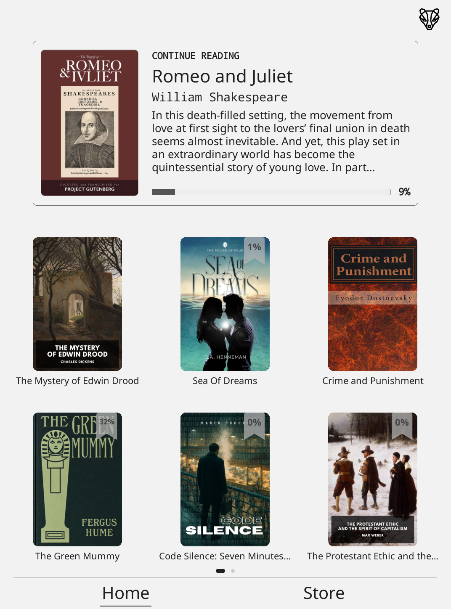
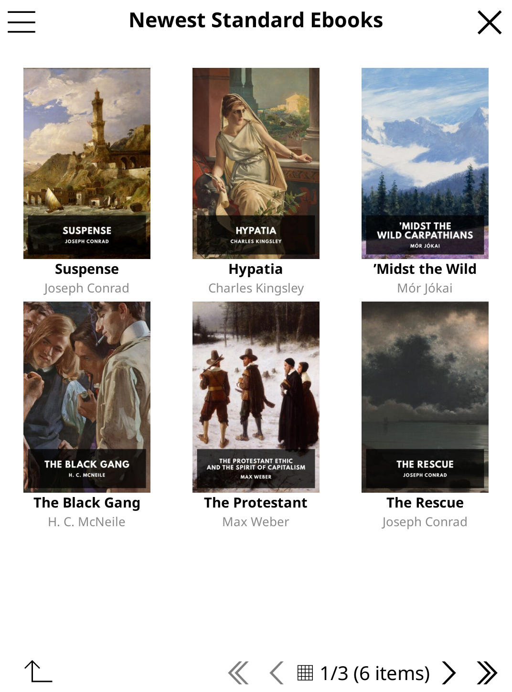
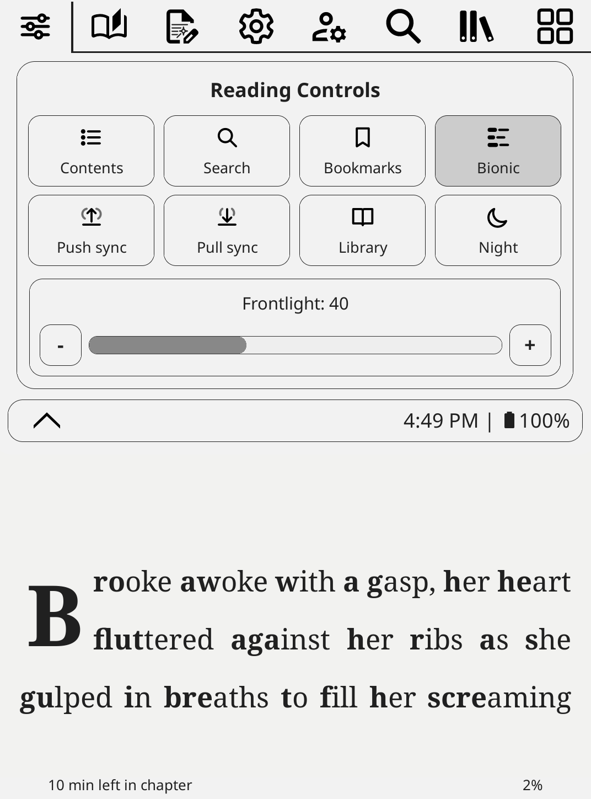

# Burrow

[](https://github.com/richbeatty/burrow.koplugin/releases)
[](https://github.com/richbeatty/burrow.koplugin/actions/workflows/validate.yml)
[](LICENSE)

**A library-first interface for KOReader.**

Burrow brings your local library, online catalogs, series navigation, and useful reader controls into one consistent, cover-forward experience.

[Download Burrow](https://github.com/richbeatty/burrow.koplugin/releases) · [Report a bug](https://github.com/richbeatty/burrow.koplugin/issues/new?template=bug_report.yml) · [Request a feature](https://github.com/richbeatty/burrow.koplugin/issues/new?template=feature_request.yml)

> Back up your KOReader data folder before installing or upgrading.

## Screenshots

| Library | Store | Reader |
|:---:|:---:|:---:|
|  |  |  |

## Features

### Library

- Cover Grid and Cover List views
- Optional automatic series folders
- Rounded book, folder, and series covers with consistent sizing
- Optional book, folder, and series titles under covers
- Reading percentage and numbered series badges
- Adjustable cover size, spacing, and grids from 1 by 1 up to 8 by 8
- Flexible top bar, hero card, page indicators, and optional labels
- Return to Library navigation independent of automatic series grouping
- Home and Store navigation throughout the configured library folder tree

### Store

- Browse OPDS catalogs in list or cover-grid views
- Download books directly into your library
- Download queue available from every catalog
- Book-format filtering that keeps cover images out of download choices
- Store styling that matches the local library

### Reading and controls

- Burrow Quick Settings in File Manager and Reader
- Optional KoSync Push and Pull actions
- Four-way rotation with remembered orientation between library, reader, and KOReader restarts
- Independent reader status-bar margins and preset cycling
- Reading-location return control
- Two-sided Reading progress footer with configurable left and right information
- Human-readable reading-time estimates such as `1 min left in chapter` and `1 hr 12 min left in book`
- Bionic Reading for EPUB books using real bold fixation prefixes while leaving the original EPUB untouched
- Search in Book support while Bionic Reading is active
- Last-used reader presentation can carry into the next book while progress, bookmarks, highlights, annotations, and reading status remain book-specific
- Native KOReader top and in-reader menus remain available

### Appearance

- Optional softer black and white palette for the KOReader interface and reflowable reader pages
- The softer palette is **off by default** and can be enabled under **Burrow Settings > Appearance**
- Optional recoloring of small monochrome EPUB ornaments to match the softer reader palette
- Optional proportional crop-to-fill for the current book cover on the sleep screen, without stretching or distortion
- Light and dark mode-aware Burrow icons and menu treatments

## Compatibility

Burrow requires **KOReader 2026.07.1 or newer** and has been tested successfully with **KOReader 2026.07.2**. Newer releases and nightlies may show a compatibility warning while testing continues.

KOReader's built-in **Cover Browser** should be disabled before using Burrow.

## Installation

1. Open [Releases](https://github.com/richbeatty/burrow.koplugin/releases) and download the latest `Burrow-*.zip` file.
2. Back up your KOReader data folder.
3. When upgrading, replace the existing `plugins/burrow.koplugin` folder.
4. Extract the ZIP into the root of the KOReader data folder.
5. Confirm the final path includes:

```text
plugins/burrow.koplugin/main.lua
```

6. Fully close and restart KOReader.

## Updates

Burrow can check GitHub Releases directly from **Burrow Settings > About Burrow > Check for Updates**.

- Stable releases use the Stable update channel.
- Prerelease builds default to the Beta update channel so testers can receive the next prerelease without exposing it to stable users.
- Automatic update checks are off by default. When enabled, Burrow checks at most once per day while KOReader is already online and always asks before installing an update.
- Downloads are SHA-256 verified, unpacked into a staging directory, checked against the package file manifest, and syntax-checked before the installed plugin is replaced.
- The updater keeps one previous Burrow version outside the live plugin folder so it can be restored from About Burrow if needed.
- Temporary downloads and staging files are removed after installation and again at the next successful Burrow startup.

## Burrow 0.4.3

Burrow 0.4.3 expands the reader side of the plugin while preserving the library and Store behavior from 0.4.2.

Highlights include:

- Bionic Reading for EPUB books
- Last-used reading-presentation inheritance between books
- A configurable two-sided Reading progress footer with compact time estimates
- An optional soft black and white palette, now off by default
- Optional recoloring for small monochrome EPUB decorative elements
- Proportional crop-to-fill for the current book cover on the sleep screen
- Continued updater, rotation, Quick Settings, library, series, and Store stability work from the beta cycle

### Known limitation

Toggling Bionic Reading can occasionally move the reading position by a few pages because real bold text changes line wrapping and pagination. Burrow uses nearby text anchoring with a percentage fallback to keep the reader close to the same passage.

Please report repeatable crashes, layout problems, failed downloads, or data-loss concerns through the issue tracker.

## Inspiration and credits

Burrow began as a personal effort to make KOReader feel more like one connected bookshelf instead of several separate tools. It would not exist without the work shared by the wider KOReader community:

- **[ProjectTitle](https://github.com/joshuacant/ProjectTitle)** by Joshua Cantrell was the cover-first library project that started this work.
- **OPDS Plus** by greywolf1499 provided the foundation for a richer catalog and Store experience.
- **[Zen UI](https://github.com/AnthonyGress/zen_ui.koplugin)** by Anthony Gress showed how a complete KOReader interface can feel focused, cohesive, and approachable.
- **[qewer33/koreader-patches](https://github.com/qewer33/koreader-patches)** and **[sebdelsol/KOReader.patches](https://github.com/sebdelsol/KOReader.patches)** provided ideas and techniques for interface controls and reader status bars.
- **[KOReader](https://github.com/koreader/koreader)** and its contributors make all of this possible.

See [`NOTICE.md`](NOTICE.md) for licensing and source acknowledgements.

## Status and contributing

Burrow is stable for regular use. Bug reports, focused fixes, documentation improvements, and additional device testing are welcome.

See [`CONTRIBUTING.md`](CONTRIBUTING.md) before opening a pull request. Please remove passwords, tokens, private catalog URLs, personal paths, and book information from screenshots or logs.

## License

Burrow is distributed under the [GNU Affero General Public License v3](LICENSE).
